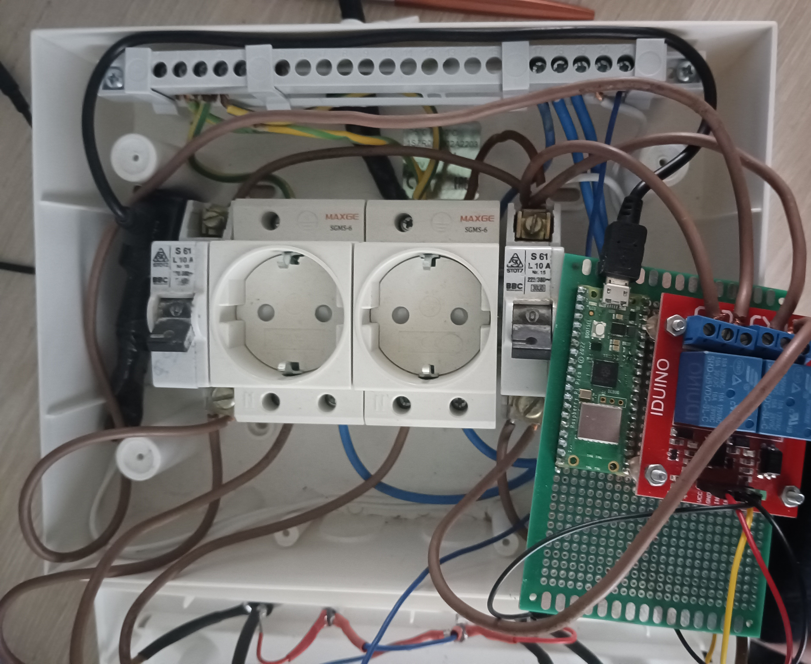
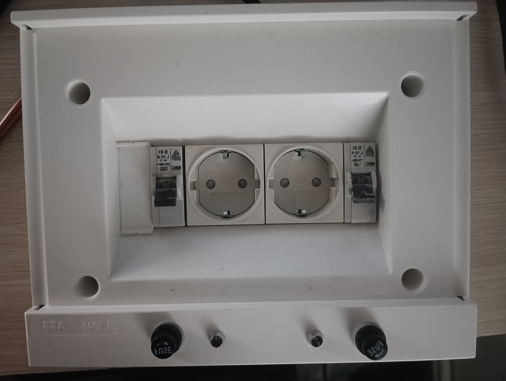

# Smart-Plug
 This project aims to develop a smart plug system. It is a full-stack IoT project, It use the Raspberry Pi Pico W microcontroller along with a relay module to control the electrical outlet. The project also includes a custom mobile application designed to facilitate remote control of the outlet using Bluetooth connectivity.

## Table of Contents

1. [Hardware Section](#Hardware-Section)
2. [Software Section](#Software-Section)
3. [Final result](#Final-result)
4. [File Decriptions](#File-Decriptions)

## Hardware Section
### Construction
In this section, we'll discuss how to construct the smart plug.

#### Materials Needed
- **Raspberry Pi Pico W** : After programming it in micropython, it is used to be able to operate the relays and to give or not to give electric current to the outlet.
- **2 channels 5V Relay Module** : It is used because the microcontroller can manage max 5V, so we give the order to relay with 3.3v to "allow" the 220v to pass through to the electrical outlet.
- **2 Electrical Outlet** : It is used to connect electrical devices.
- **220v to 5v converter or a rasberry pi pico w power supply** : It is used to give microcontroller power.
- **Bypass switch**  : If we dont want to use microcontroller we can bypass the electricity to the electrical outlet.
- **Indicator Led** : It is used to see if one electrical outlet have electricity(it is open if it has and closed if it has not).
- **2 Neutral, Ground rail**
- **Wires**

#### Electrical Circuit Diagram

## Software Section
### Mobile Application Setup
In this section, we'll discuss how to set up the custom mobile application for controlling the smart plug via Bluetooth. To create the application we have used MIT App Inventor([Mit App Inventor](https://appinventor.mit.edu/)). 

#### Application Explenation
- **Menu** : Is the menu of the app and we can choose the function we want to operate.

- **Dashboard** : Ηere we see if we have any device connected and if so we see the MAC address.

- **Scan Devices** : Ηere we can find a device to connect or if we know the MAC we can connect directly(suggested to scan first). Also we can disconnect from the device.

  

- **Control Device** : Ηere we can control the microcontroller.

- **Cmd Device** : Here we can directly give custom commands to the microcontroller.

#### Installation Steps
In the Mobile_App folder contained the .apk file that can be directly installed on the mobile. Also contained the .aia file that can be imported in the [Mit App Inventor](https://appinventor.mit.edu/) and configure the application.

Finally, the application uses a database, so if it is connected to the device once, then every time it is opened, it will be connected automatically, unless we disconnected.

## Final result
    

## File Decriptions

The project consists of the following folders and files:
1. **rasberry_pi_pico_W_bluetooth** : Contains the Micropython code that we use in the rasberry pi pico w.
    - **main.py**: Is the main file of the project and run every time we give power to the microcontroller.
    - **bluetoothProj.py**: Manages device functions.
    - **ble_advertising.py, ble_simple_peripheral.py**: Initialize bluetooth functionality.

2. **Mobile_App** : 
    - **MCManage.apk file** :This is the mobile app that we can directly install in the mobile.
    - **MCManage.aia file** :This file can be imported in the [Mit App Inventor](https://appinventor.mit.edu/) and configure the application.
    - **Extensions** : Contains all the extensions we have used in the Application.
    - **Icons** : Contains the Icons we have used in the Application.
3. **Project_Images** : Contains all the Images that we use in the readme file.

